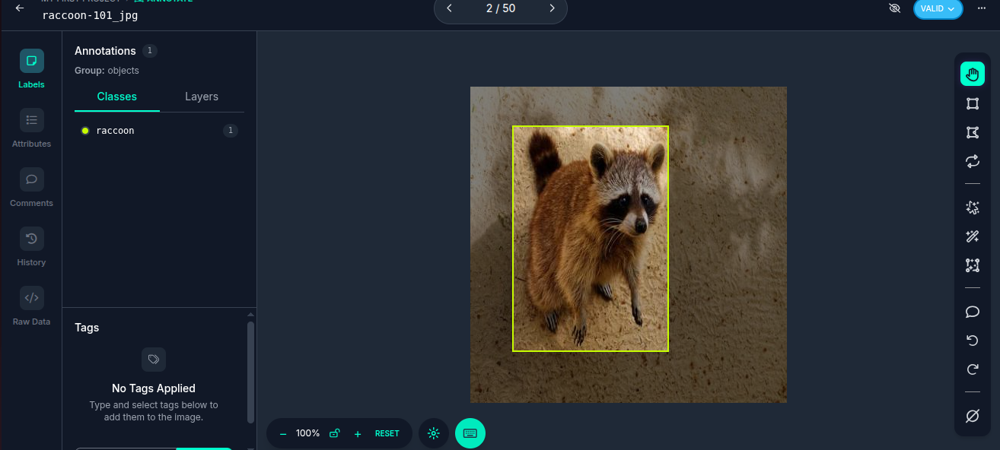
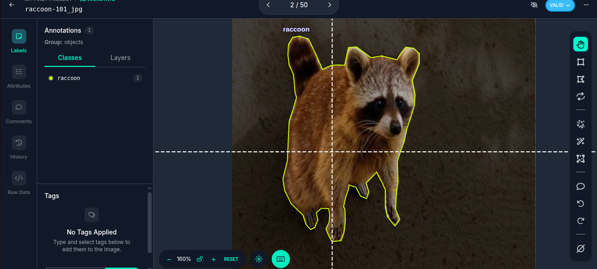

# 🖼️ Image Annotation Portfolio – Debasish Mahapatra

Welcome to my image annotation portfolio! I specialize in computer vision dataset preparation using bounding boxes, segmentation, and keypoint annotations for machine learning tasks such as object detection, image classification, OCR, and more.

---

## ✅ Conmon Annotation Formats

- **COCO (JSON)**
- **Pascal VOC (XML)**
- **YOLOv5/v8 (TXT)**
- **LabelMe**
- **Roboflow Exports**

---

## 🧰 Tools I Use

- [Roboflow](https://roboflow.com/)
- LabelImg (for VOC)
- CVAT (for polygon/segmentation)

---

## 📦 Sample Datasets

| Dataset | Format | Annotation Type | Link |
|--------|--------|------------------|------|
| Vehicle Detection | COCO JSON | Bounding Boxes | [Download](https://github.com/debasishmahapatra/datasets/raw/main/sample-coco.zip) |
| Road Signs | Pascal VOC | Bounding Boxes | [Download](https://github.com/debasishmahapatra/datasets/raw/main/sample-voc.zip) |

Note: These datasets are subsets generated using Roboflow and are for demo purposes only.

---

## 🖼️ Sample Annotation Screenshots

| Bounding Box Annotation | Polygon Segmentation |
|-------------------------|----------------------|
|  |  |

---

## 📜 Services I Provide

- 📦 Dataset conversion (COCO ↔ VOC ↔ YOLO)
- 🔍 Annotation review and cleanup
- 🧠 Custom class labeling & attribute tagging
- 🧪 Quality-check scripts in Python

---

## 📬 Let's Work Together!

> I’m open for freelance and contract-based image annotation tasks.
> Reach out for:
> - Object Detection / Segmentation Dataset Annotation
> - Annotation Format Conversion
> - Dataset QC and Cleanup

📧 Email: debasishmahapatra218@gmail.com  
🔗 LinkedIn: [linkedin.com/in/debasish]([https://linkedin.com/in/debasish](https://www.linkedin.com/in/debasish-mahapatra-161b22237/))  

---

⭐ *Thank you for visiting! Feel free to clone or fork this repo to explore sample annotation datasets.*
